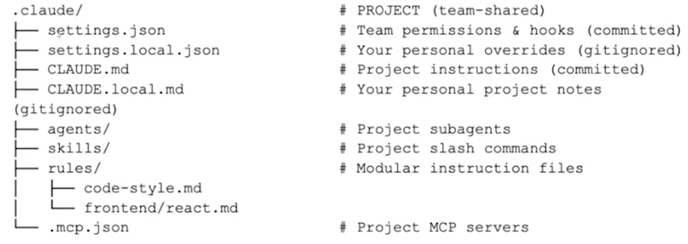

# Agentic AI

## What is CLAUDE.md ?

`CLAUDE.md` is a configuration or instruction file used when working with Claude AI tools. It contains guidelines that help the AI understand how to interact with a project. It acts like a navigation guide or steering direction for the AI, helping it understand how to behave in the project. 

The file can include information such as:
- project structure
- coding guidelines
- preferred tools or frameworks
- instructions on how the AI should assist with the codebase

## What is .claude directory ?
The .claude directory is a folder used to store configuration and support files for Claude AI tools when working in a project.
<<<<<<< HEAD
The .claude directory helps organize all AI-related settings and keeps them separate from the main application code.

```bash

```
=======

>>>>>>> 5acb6d858d8bebb75d8824f5b60b16f91ce10a3b
